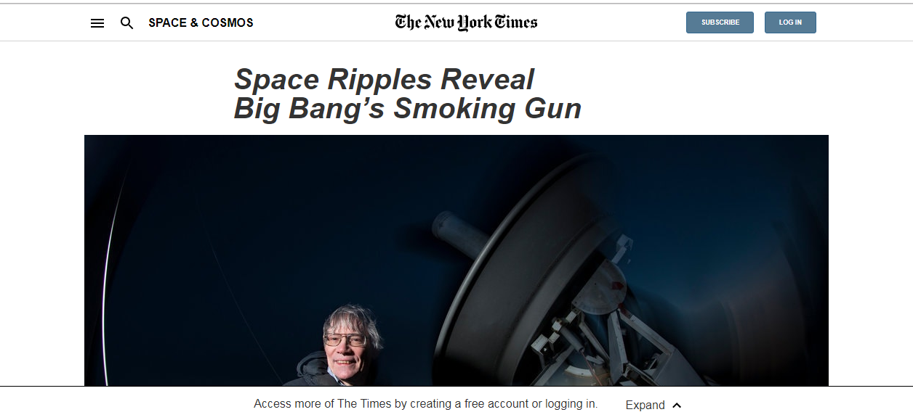

# New York Times Article Page Clone

> Microverse inspired project to clone [a new york times article page](https://www.nytimes.com/2014/03/18/science/space/detection-of-waves-in-space-buttresses-landmark-theory-of-big-bang.html?_r=0) using the css [float](https://www.w3schools.com/css/css_float.asp) property.

This project is meant to test knowledge on floating and positioning of elements with the [float](https://www.w3schools.com/css/css_float.asp) and [position](https://www.w3schools.com/css/css_positioning.asp) properties.

## Built With

- HTML,
- CSS

## Live Demo

View the live demo [here](https://raw.githack.com/ivanid22/microverse-nyt-clone/features/index.html)

## Authors

👤 **Daizy Obura**

- Github: [@dxania](https://github.com/dxania)

👤 **Ivan Diaz**

- Github: [@ivanid22](https://github.com/ivanid22)

## Show your support

Give a ⭐️ if you like this project!
